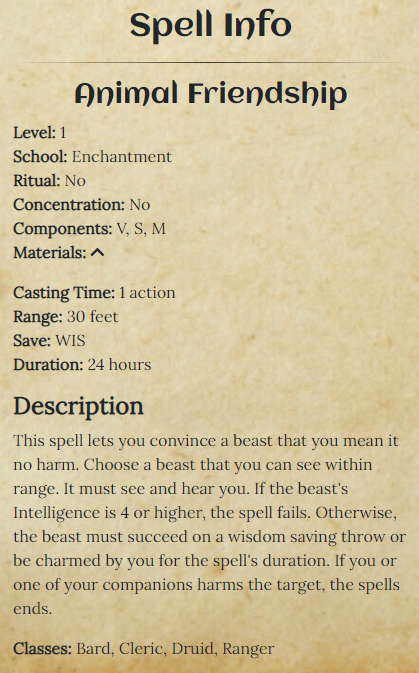
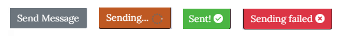

# SpellBook
## Project Goals
SpellBook is intended a resource for players of the tabletop role playing game, Dungeons & Dragons (D&D), published by Wizards of the Coast (Wizards).

SpellBook offers a quick, simple and interactive way for players to look up the  Spells associated with the different D&D classes, and to examine the game rules for each Spell in detail.

User Goals:
- Find information on Spells for use in game.
- Players may use this site while playing with other people, and as such need to be able to find the information in a timely, straightforward manner to minimize disruption to the game.

Site Owner Goal:
- Provide a streamlined, interactive interface that users can navigate easily and quickly to find the information they need.

*A screenshot of the Home page (index.html) as viewed on different screen sizes, generated on [ami.responsivedesign.is](http://ami.responsivedesign.is/). An interactive scrollable version is available [here](http://ami.responsivedesign.is/?url=https://kevinoc554.github.io/spellbook/index.html).*

# UX
### User Stories
1. As a user, I want to be able to view a list of Spells associated with each Class.
2. As a user, I want to be able to search through the list to locate a particular Spell.
3. As a user, I want to be able to view the game information and description for a particular Spell.
4. As a user, I want to be able to contact the Site Owner to provide feedback or request further features.
5. As the site owner, I want to be able to provide clear documentation on the licence under which the game information is provided, and attribution wherever copyrighted material is used.

### Wireframes
- [index.html](wireframes/index.pdf)
- [contact.html](wireframes/contact.pdf)
- [about.html](wireframes/about.pdf)

# Features
## Across the site
- Navigaton Bar
    - A navigation bar is present on all three pages of the site, fixed to the top to ensure the user can always access it.
    - The bar consists of a brand icon (which links back to the homepage), and three navigation links (one to each of the site's pages).
    - The navigation link for the current page displays as highlighted, to provide visual feedback to the user.
    - On mobile devices, the navigation bar is toggled into view with the hamburger icon in the top right corner. Tapping this icon will cause the navigation bar to slide in from off screen in a smooth animation.
    

*A screenshot of the Navigation bar as viewed on larger screen sizes*

- Hero Image
    - A hero image displays on each of the site's pages, overlaid with the site's title.
    - The image chosen for this jumbotron is the cover artwork of the official Dungeons & Dragons Player Handbook, used here as part of the Fan Site Kit. 
    - This provides a visual consistency; not only across the pages of the site but also with the official D&D products, with which the users will already be familiar.

*A screenshot of the Hero Image*

- Return to Top Button
    - A return to top button is present on each page on the site, which allows the user to navigate back to the top of the content with ease from any point on the page.
    - The button is initially hidden, and fades into view when the user begins to scroll down the page.
    - Clicking on the button will cause the viewport to smoothly scroll back to the top.

*Return to top button*

- Footer
    - The footer, which is present on all pages of the site, provides links to the site owner's social media pages, along with a link to the project's GitHub repository. All these links open in a new browser tab, allowing the user to navigate back to this site with ease.
    - Also in the footer, the user will find links to the site's About page, which they can follow to find out more about how the project works. The different links will direct the user to the different headings on the About page, allowing the user to navigate directly to the topic that interests them.
    - Lastly, the footer also contains some legal disclaimer text, which states that Wizards of the Coast, Dungeons & Dragons, and their logos are trademarks of Wizards of the Coast LLC and provides links to both the Fan Site Kit and to Wizard's own site.

*A screenshot of the footer as viewed on larger screen sizes*

## Homepage Features
- Instructions
    - The first time a user visit's the site, a set of instructions will appear under the hero image.
    - This text outlines how to use the site, providing enough information to get the user started with the site's functionality.
    - Once a user interacts with the site by choosing a Class and then a Spell, the browser will "remember" this, and the instructions text will be hidden on future visits.
    - However, should the user need more information, the instructions text can be toggled between hidden and displayed at any time by clicking the chevron next to the Instructions heading.

*A screenshot of the Instructions section*

- Class Row
    - Under the instructions, the user is shown a selection of Dungeons & Dragons classes to choose from.
    - On mobile screens, these are displayed as tappable oval icons containing the Class names.
    - On larger screens, these Class names are accompanied by their associated icons from the Fan Site Kit, which are both visually striking and help convey more information about the Classes.
    - Regardless of screen size, the background of the Class icons changes when they are clicked in order to indicate which Class is currently chosen.

*A screenshot of the Class Icon Row as viewed on larger screen sizes. The Bard Class is selected.*

- Class Spell List
    - When a class is chosen from the section above, a request is sent to the DnD API, and a list of the spells associated with that class is created and displayed as a table here.
    - This list displays alphabetically (A-Z), and the order can be inverted by clicking on the table heading.
    - The user can filter the list at any time by typing into the search input.
    - If there are more than 10 results, some pagination buttons will appear at the bottom of the table to allow users to navigate the results.
    - The user can also choose how many results to display per page using a drop down at the top.
    - When a Spell's row in the table is clicked, its background colour will change to indicate that it is the active Spell.
    - On the site's first load, the first Class alphabetically (Bard) is selected. On subsequent visits, the site will read information written to local storage to "remember" which class was displayed last and will show that list instead.

        

        *A screenshot of the Class Spell List as viewed on mobile screen sizes. The Bard Class and Animal Friendship Spell are selected.*

- Spell Data
    - When a Spell is selected from the table above, a request is sent to the DnD API again, this time requesting the details of that spell. The return data is then written to the DOM as the Spell Data section.
    - This section will always display the information common to all Spells in D&D; the spell's name, level, school, range, casting time and description will always be shown.
    - Non-essential information (e.g. spell materials, damage at higher levels), is initially hidden from the user's view to prevent cluttering the page, but can be displayed by clicking on the chevron next to the relevant item.
    - Regarding the features that are not common to all Spells, the site's JavaScript is designed (using a series of "if" statements) to only display the categories that are relevant to the chosen spell, e.g. the Damage Per Spell Level will not appear for a spell that does not cause damage. This aims to prevent showing the user irrelevant categories or items that are `undefined`, which would be a poor user experience.
    - On the site's first load, the first Spell in the Bard Class (Animal Friendship) is selected. On subsequent visits, the site will read information written to local storage to "remember" which spell was displayed last and will show that information instead.

        

        *A screenshot of the Spell Data Section as viewed on mobile screen sizes. The Animal Friendship Spell is selected.*

## About Page Features
- About Text
    - The text of the About page is divided into three sections:
        - "What do we do?": This section provides a quick description of the site's purpose and functionality, along with a link to the project's GitHub repository.
        - "How does it work?": This section provides some information about the API used to power the site, along with the Open Gaming Licence under which the information is provided.
        - "Legal Disclaimer": This section contains the full text of the Open Gaming Licence.

- Table of Contents
    - The About page's Table of Contents consists of a list of clickable links that bring the user directly to the different headings on the About page.
    - In combination with the Return to Top button, the table of contents allows users to quickly and easily navigate the About page to find whatever information they need.

        

        *Table of Contents*

## Contact Page
- Contact Form
    - The site's contact form consists of three input fields; one each for the user's name, email address and message.
    - Each field is required, and the form will not submit if any are left empty. The user will instead be shown a prompt to complete any empty fields.
    - The email field will also check that the text provided is in the form of an email address, and will prompt the user instead of submitting if it is not.
    - On a successful submit, the form will send an email to the site's owner (using EmailJS) containing the information in the fields.

        

        *Contact form, as viewed on mobile*

- Submit Button
    - Along with the prompts described above, the site's submit button will also provide feedback to the user.
    - The submit button has four visually distinct variations that can display throughout the process:
        - Send Message: The default submit button visible on load.
        - Sending: Once the Send Message button is clicked (provided the form data provided is validated, as described above) the button will change to Sending. This button is orange in colour and displays a throbber/loading gif to communicate to the user that their action is being processed.
        - Sent: Once the request to the EmailJS API is successfully completed, and an email has been sent, the button will change to Sent. This button displays as green, and shows a tick icon to indicate the action has been successful.
        - Sending Failed: If the request is unable to process for any reason, the button will change to Sending Failed, and an error will log to the console. This button is red in colour, and shows an X icon to indicate that the action has failed. Additionally, if the Sending Failed button is displayed, the form content will not be deleted, which means the user's inputted text has not been lost.
     *The four variations of the Send Button*

## Features To Be Implemented
- User Accounts 
    - Users will be able to create their own personalised lists of spells for each of their D&D characters, and save them to their accounts for future use.

# Technologies Used
- HTML5 - the pages of this site were designed using HTML.
- CSS3 - the pages of this site were styled using CSS.
- JavaScript - the interactive elements of this site were implemented using JavaScript.
- [Gitpod](https://www.gitpod.io/) - the site was developed using Gitpod as the development environment.
- [Bootstrap](https://getbootstrap.com/) - Bootstrap was used to structure the layout of the site and assist in making it responsive.
- [jQuery](https://jquery.com/) - jQuery was used to simplify and condense JavaScript, particularly for interacting with, and writing to, the DOM. 
- [DataTables](https://www.datatables.net/) - DataTables was used to add ordering and filtering functionality to the site's tables.
- [Font Awesome](https://fontawesome.com/) - Font Awesome icons were used for the social media links in the footer.
- [Google Fonts](https://fonts.google.com/) - Google Fonts were used throughout the project.
- [Hover.CSS](https://ianlunn.github.io/Hover/) - Hover.CSS was used to add hover effects to social media links in the footer.
- [Image Color Picker](https://imagecolorpicker.com/) - Image Color Picker was used to select the site's color palette.
- [WebAIM Contrast Checker](https://webaim.org/resources/contrastchecker/) - Contrast Checker was used to ensure there was sufficient contrast between foreground and background colours.
- [D&D 5e API](http://www.dnd5eapi.co/) - All game information was requested via this API.
- [EmailJS](https://www.emailjs.com/) - The EmailJS API was used in order to send submitted data from contact.html to the site owner.
- [Free Logo Design](https://www.freelogodesign.org/) - The site's brand logo was created using Free Logo Design.
- [Favicon Generator](https://www.favicongenerator.com/) - Favicon Generator was used to create and size the favicon for the site, using the logo created above.
- [Squoosh](https://squoosh.app/) - All images used on the site were compressed and resized using Squoosh.

# Testing
## Validation:
### HTML
- The HTML for the site's four pages was passed through the W3C Markup Validation Service, and no errors or warnings were found.
### CSS
- The site's CSS was passed through the W3C CSS Validation Service, and no errors were found.
- The validation tool highlighted some vendor prefixes which were added by [Autoprefixer](http://autoprefixer.github.io/) to ensure cross-browser support.
### JS
- The site's JavaScript was validated using JSHint. 
## Automated Testing
- Each page of the site was evaluated using [Lighthouse](https://developers.google.com/web/tools/lighthouse/) to assess them on four metrics; Performance, Accessibility, Best Practices & Search Engine Optimization (SEO).
- The following changes were implemented:
    - Colours across the site were updated (with the help of [WebAim](https://webaim.org/resources/contrastchecker/) Contrast Checker) to ensure there was sufficient contrast between foreground and background colours.
    - The size and spacing of the tap targets in both the Footer and the Table of Contents were increased having been flagged as being too small/close together.
    - The font size of the legal disclaimer in the footer was increased to ensure all text on the site was of a sufficient size.
### Testing of User Stories
### Manual Testing

# Bugs
### Fixed
- **Bug:** The search input added by the DataTables plugin was displaying incorrectly on tablet-sized screens.
    - **Issue:** DataTables creates a Bootstrap `.row` containing two `.col` divs to position both the search input and the dropdown to determine number of results per page. These `.col` divs were displaying incorrectly, due to the classes that were applied by DataTables.
    - **Fix:** Use JavaScript to target the `.col` on creation, remove the offending class and add the correct one.
- **Bug:** The return to top button was causing the viewport to jump to the top, rather than a smooth scroll.
    - **Issue:** Was using JQuery to target the `window` and set the `.scrollTop()` to `0` on click, causing the page to jump to the top.
    - **Fix:** Targeted the `html` element instead of the `window`, and used the `.animate()` method to set the `scrollTop` to `0` smoothly over the course of `1000ms`.
- **Bug:** When using links to target specific elements by their ID, the element was being overlaid by the site's fixed navbar.
    - **Issue:** The links were causing the top of the target element to sit at the very top of the window, which meant the fixed navbar was obscuring them.
    - **Fix:** Applied a positive `padding-top` and a corresponding negative `margin-top` to the target elements. This fixed the bug, but caused issues on mobile screens as the new padding on the first element was blocking clicks on links. This was fixed by changing the `z-index` of the divs.
- **Bug:** Was unable to apply a class to a table row on load, as part of the `document.ready` function.
    - **Issue:** The element is created by fetching the information from the API and writing it to the DOM as a Bootstrap table, which is subsequently styled by DataTables. This extra work meant that the element did not exist at the time that the `.addClass()` was being called.
    - **Fix:** Used a `setTimeout()` function to delay calling the `.addClass()` until after the element has loaded.
### Bugs to be fixed

# Deployment
- This site was developed in [Gitpod](https://www.gitpod.io/), committed and pushed to [Github](https://github.com/), and deployed on [GitHub Pages](https://pages.github.com/).
- At the time of submission, there are no differences between the development version and deployed version of the site.

### The following steps were taken to deploy this site:
- Logged in to Github and navigated to the site's **[repository](https://github.com/kevinoc554/spellbook)**.
- Clicked on **Settings** in the toolbar near the top of the screen.
- Clicked on **Pages** on the left side of the **Settings** page.
- Under the **Source** heading, clicked on the **Branch** dropdown, and selected **Master**.
- Clicked on **Save**, deploying the site.
- Clicked on the URL at the top of the **GitHub Pages** section to navigate to the live site.
- *More info on deploying to **GitHub Pages** can be found [here](https://docs.github.com/en/github/working-with-github-pages/creating-a-github-pages-site#creating-your-site).*

### To run and edit the code for this site locally, follow these steps:
* Log in to GitHub and navigate to the site's **[repository](https://github.com/kevinoc554/spellbook)**.
* Click on the green **Code** button.
* Copy the URL under **Clone with HTTPS** by clicking on the **Copy** button.
* Open the terminal in your IDE, and navigate to the desired directory.
* Type `git clone` into the terminal, and paste in the copied URL, e.g.,  
``git clone https://github.com/kevinoc554/spellbook.git``
* Press enter to clone the repository.
* *More info on cloning a **GitHub** repository can be found [here](https://docs.github.com/en/github/creating-cloning-and-archiving-repositories/cloning-a-repository).*

# Credits
### Code
- The site's responsive offcanvas navbar was adapted from a Bootstrap example [here](https://getbootstrap.com/docs/4.6/examples/offcanvas/).
- Code to allow users to interupt scroll animation adapted from StackOverflow question [here](https://stackoverflow.com/questions/2834667/how-can-i-differentiate-a-manual-scroll-via-mousewheel-scrollbar-from-a-javasc).
### Content
### Media
- Hero images and Class Icons on the site are taken from the official Dungeons & Dragons Fan Site Kit, and used in line with Wizard's [Fan Site Kit Policy](https://dnd.wizards.com/articles/features/fan-site-kit).
- Ink well image used under Creative Commons licence from [pngall.com](http://www.pngall.com/?p=26696).
- Loading .gif courtesy of [acegif.com](https://acegif.com/gifs-loading/).
### Acknowledgements